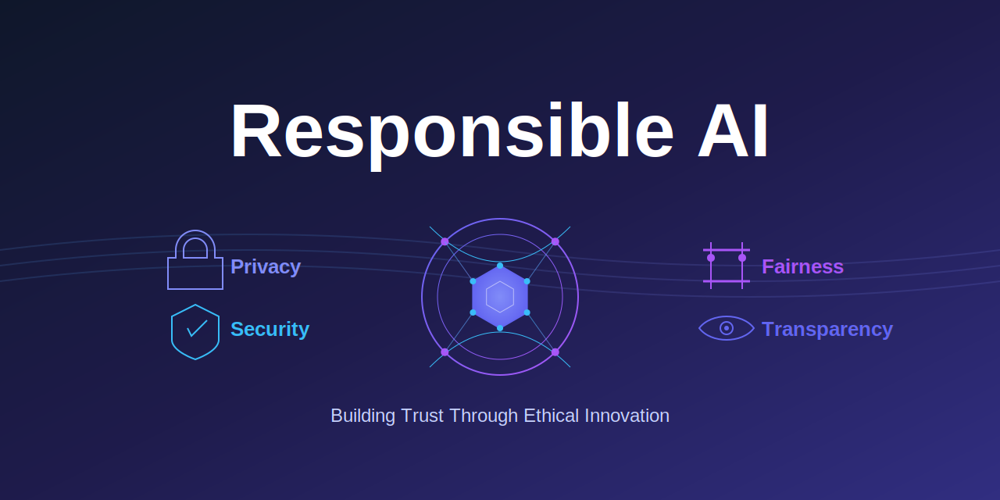
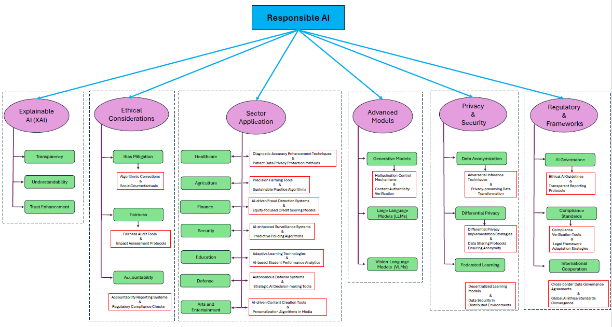

# "Who is Responsible? The Data, Models, Users or Regulations? A Comprehensive Survey on Responsible Generative AI for a Sustainable Future"

<div align=center></div>

## 🌟 Overview
[Who is Responsible? The Data, Models, Users or Regulations? Responsible Generative AI for a Sustainable Future](https://www.techrxiv.org/doi/full/10.36227/techrxiv.173834932.29831105/v1)

Welcome to the **2025 updated edition** of our Responsible AI survey paper repository. This comprehensive collection includes the latest papers and developments in the Responsible AI domain, reflecting the rapidly evolving landscape of 2024-2025.

## What is Responsible AI?
Responsible Artificial Intelligence (RAI) encompasses the principles, practices, and frameworks governing the design, deployment, and operation of AI systems to ensure they function in accordance with ethical standards, maintain transparency in their decision-making processes, demonstrate clear accountability mechanisms, and fundamentally align with societal values and human welfare objectives.

<div align=center></div>

## 📊 Recent Developments (2024-2025)

**Key Trends:**
- RAI papers at leading AI conferences increased by 28.8% from 2023 to 2024 (992 to 1,278 papers)
- 78% of organizations now use AI in at least one business function, up from 55% in early 2023
- The EU AI Act entered into force on August 1, 2024, as the world's first comprehensive AI legal framework
- Environmental concerns have intensified with GPU shipments to data centers increasing from 2.67 million in 2022 to 3.85 million in 2023

This repository provides an overview of RAI papers in the following areas:
- **Explainable AI [XAI]**
- **Ethical Considerations & Bias Mitigation**
- **AI Governance & Regulatory Frameworks**
- **Environmental Sustainability**
- **Sector Applications**
- **Advanced Models & Safety**
- **Privacy and Security**

## 1. Recent RAI Surveys (2024-2025)

### Latest Comprehensive Surveys
- [2025] **The 2025 AI Index Report** *Stanford HAI* [[report](https://hai.stanford.edu/ai-index/2025-ai-index-report)]
- [2024] **Recent Applications of Explainable AI (XAI): A Systematic Literature Review** *Applied Sciences* [[paper](https://www.mdpi.com/2076-3417/14/19/8884)]
- [2024] **Policy advice and best practices on bias and fairness in AI** *Ethics and Information Technology* [[paper](https://link.springer.com/article/10.1007/s10676-024-09746-w)]
- [2024] **Fairness and Bias in Artificial Intelligence: A Brief Survey of Sources, Impacts, and Mitigation Strategies** *Sci* [[paper](https://www.mdpi.com/2413-4155/6/1/3)]
- [2024] **AI Fairness in Data Management and Analytics: A Review on Challenges, Methodologies and Applications** *Applied Sciences* [[paper](https://www.mdpi.com/2076-3417/13/18/10258)]
- [2024] **Evaluating privacy, security, and trust perceptions in conversational AI: A systematic review** *A Leschanowsky, S Rech, B Popp, T Bäckström* [[paper](https://www.sciencedirect.com/science/article/pii/S0747563224002127)]
- [2024] **Fairness in Machine Learning: A Survey.** *Simon Caton and Christian Haas* [[paper](https://dl.acm.org/doi/10.1145/3616865)]
- [2024/10] **Responsible AI in the Global Context: Maturity Model and Survey** *Anka Reuel,Patrick Connolly* [[paper](https://arxiv.org/pdf/2410.09985)]
- [2024/4] **Responsible AI Pattern Catalogue: A Collection of Best Practices for AI Governance and Engineering** *Qinghua Lu, Liming Zhu* [[paper](https://dl.acm.org/doi/full/10.1145/3626234)]

### Healthcare & Medical Applications
- [2024] **A survey of recent methods for addressing AI fairness and bias in biomedicine** *ScienceDirect* [[paper](https://www.sciencedirect.com/science/article/pii/S1532046424000649)]
- [2024] **Interpreting artificial intelligence models: a systematic review on the application of LIME and SHAP in Alzheimer's disease detection** *PMC* [[paper](https://pmc.ncbi.nlm.nih.gov/articles/PMC10997568/)]
- [2024] **Ethical and Bias Considerations in Artificial Intelligence/Machine Learning** *ScienceDirect* [[paper](https://www.sciencedirect.com/science/article/pii/S0893395224002667)]

## 2. Latest RAI Papers (2024-2025)

### 2.1 Explainable AI & Interpretability

#### Recent Advances in XAI Methods
- [2025] **A Perspective on Explainable Artificial Intelligence Methods: SHAP and LIME** *Advanced Intelligent Systems* [[paper](https://advanced.onlinelibrary.wiley.com/doi/full/10.1002/aisy.202400304)]
- [2025] **Explainable AI for Forensic Analysis: A Comparative Study of SHAP and LIME in Intrusion Detection Models** *MDPI Applied Sciences* [[paper](https://www.mdpi.com/2076-3417/15/13/7329)]
- [2024] **Interpreting artificial intelligence models: a systematic review on the application of LIME and SHAP in Alzheimer's disease detection** *Brain Informatics* [[paper](https://braininformatics.springeropen.com/articles/10.1186/s40708-024-00222-1)]

#### XAI Applications & Case Studies
- **Explainable AI (XAI): The Complete Guide (2025)** *viso.ai* [[guide](https://viso.ai/deep-learning/explainable-ai/)]
- **Focus! Rating XAI Methods and Finding Biases** *Anna Arias-Duart, Ferran Parés*[[paper](https://ieeexplore.ieee.org/abstract/document/9882821)]
- **Explainable Artificial Intelligence (XAI): Concepts, taxonomies, opportunities and challenges toward responsible AI** *Alejandro Barredo Arrieta, Natalia Díaz-Rodríguez*[[paper](https://www.sciencedirect.com/science/article/abs/pii/S1566253519308103)]

### 2.2 AI Ethics, Fairness & Bias Mitigation

#### Recent Ethical Frameworks & Guidelines
- [2025] **AI Ethics: Integrating Transparency, Fairness, and Privacy in AI Development** *Taylor & Francis* [[paper](https://www.tandfonline.com/doi/full/10.1080/08839514.2025.2463722)]
- [2024] **Navigating algorithm bias in AI: ensuring fairness and trust in Africa** *Frontiers* [[paper](https://www.frontiersin.org/journals/research-metrics-and-analytics/articles/10.3389/frma.2024.1486600/full)]
- [2025] **Artificial intelligence bias auditing – current approaches, challenges and lessons from practice** *Emerald Insight* [[paper](https://www.emerald.com/insight/content/doi/10.1108/raf-01-2025-0006/full/html)]

#### Bias Detection & Mitigation Techniques
- **AI Fairness in Data Management and Analytics: A Review on Challenges, Methodologies and Applications** *MDPI Applied Sciences* [[paper](https://www.mdpi.com/2076-3417/13/18/10258)]
- **Ethical Challenges and Solutions of Generative AI: An Interdisciplinary Perspective** * Mousa Al-kfairy ,Dheya Mustafa*[[paper](https://arxiv.org/pdf/2410.09985)]
- **Socially Responsible AI Algorithms: Issues, Purposes, and Challenges** *L Cheng, KR Varshney*[[paper](https://www.jair.org/index.php/jair/article/view/12814)]

### 2.3 AI Governance & Regulatory Frameworks

#### Major Regulatory Developments
- [2024] **EU AI Act Implementation** *European Commission* [[official](https://digital-strategy.ec.europa.eu/en/policies/regulatory-framework-ai)]
- [2024] **NIST AI Risk Management Framework Updates** *NIST* [[framework](https://www.nist.gov/itl/ai-risk-management-framework)]
- [2025] **Use ISO 42001 & NIST AI RMF to Help with the EU AI Act** *CSA* [[guide](https://cloudsecurityalliance.org/blog/2025/01/29/how-can-iso-iec-42001-nist-ai-rmf-help-comply-with-the-eu-ai-act)]

#### Comparative Regulatory Analysis
- [2024] **The EU and U.S. diverge on AI regulation: A transatlantic comparison and steps to alignment** *Brookings* [[analysis](https://www.brookings.edu/articles/the-eu-and-us-diverge-on-ai-regulation-a-transatlantic-comparison-and-steps-to-alignment/)]
- [2025] **Navigating AI Compliance: An Integrated Approach to the NIST AI RMF & EU AI Act** *Securiti* [[whitepaper](https://securiti.ai/whitepapers/an-approach-to-nist-ai-rmf-and-eu-ai-act/)]

### 2.4 Environmental Sustainability & Green AI

#### Carbon Footprint & Environmental Impact Studies
- [2024] **The Climate and Sustainability Implications of Generative AI** *MIT Climate & Sustainability Consortium* [[paper](https://impactclimate.mit.edu/2024/04/10/considering-the-environmental-impacts-of-generative-ai-to-spark-responsible-development/)]
- [2025] **Explained: Generative AI's environmental impact** *MIT News* [[article](https://news.mit.edu/2025/explained-generative-ai-environmental-impact-0117)]
- [2025] **Environmental Impact of Generative AI | Stats & Facts for 2025** *The Sustainable Agency* [[report](https://thesustainableagency.com/blog/environmental-impact-of-generative-ai/)]
- [2024] **Impacts of generative AI on sustainability** *PwC* [[analysis](https://www.pwc.com/us/en/tech-effect/emerging-tech/impacts-of-generative-ai-on-sustainability.html)]

#### Sustainable AI Practices
- **Green Algorithms: Quantifying the carbon emissions of computation** *Lannelongue, L. et al.* [[paper](https://arxiv.org/abs/2007.07610)]
- **Sustainable AI: AI for sustainability and the sustainability of AI** *van Wynsberghe, A.* [[paper](https://link.springer.com/article/10.1007/s10676-021-00043-6)]
- **Making AI Less "Thirsty": Uncovering and Addressing the Secret Water Footprint of AI Models** *Li, P., Yang, J., Islam, M. A., & Ren, S.* [[paper](https://arxiv.org/pdf/2304.03271)]

### 2.5 Privacy & Security in AI

#### Latest Privacy Frameworks
- [2024-2025] **AI and Privacy: Shifting from 2024 to 2025** *CSA* [[analysis](https://cloudsecurityalliance.org/blog/2025/04/22/ai-and-privacy-2024-to-2025-embracing-the-future-of-global-legal-developments)]
- **Ted-spad: Temporal distinctiveness for self-supervised privacy-preservation for video anomaly detection** *J Fioresi, IR Dave, M Shah* [[paper](https://openaccess.thecvf.com/content/ICCV2023/html/Fioresi_TeD-SPAD_Temporal_Distinctiveness_for_Self-Supervised_Privacy-Preservation_for_Video_Anomaly_Detection_ICCV_2023_paper.html)]

#### Security & Adversarial AI
- [2024] **Adversarial Machine Learning: A Taxonomy and Terminology of Attacks and Mitigations** *NIST* [[paper](https://www.nist.gov/publications/adversarial-machine-learning-taxonomy-and-terminology-attacks-and-mitigations)]
- [2024] **EU AI Act, US NIST Target Cyberattacks on AI Systems** *Morgan Lewis* [[analysis](https://www.morganlewis.com/pubs/2024/07/eu-ai-act-us-nist-target-cyberattacks-on-ai-systems-guidance-and-reporting-obligations)]

### 2.6 Advanced Models & Foundation Model Governance

#### Foundation Model Transparency & Evaluation
- **FAIR Enough: Develop and Assess a FAIR-Compliant Dataset for Large Language Model Training?** *S Raza, S Ghuge, C Ding, E Dolatabadi, D Pandya* [[paper](https://direct.mit.edu/dint/article/6/2/559/123375)]  
- **Exploring Memorization and Copyright Violation in Frontier LLMs: A Study of the New York Times v. OpenAI 2023 Lawsuit** *J Freeman, C Rippe, E Debenedetti, M Andriushchenko* [[paper](https://openreview.net/forum?id=C66DBl9At8)]

#### Generative AI Governance
- **Generative AI in Creative Practice: ML-Artist Folk Theories of T2I Use, Harm, and Harm-Reduction** *Renee Shelby,Shalaleh Rismani,Negar Rostamzadeh* [[paper](https://dl.acm.org/doi/full/10.1145/3613904.3642461)]
- **Evolving Generative AI: Entangling the Accountability Relationship** *Marc T.J Elliott, Deepak P* [[paper](https://dl.acm.org/doi/abs/10.1145/3664823)]

### 2.7 Industry Reports & Practical Implementation

#### Latest Industry Surveys
- [2024] **PwC's 2024 US Responsible AI Survey** *PwC* [[report](https://www.pwc.com/us/en/tech-effect/ai-analytics/responsible-ai-survey.html)]
- [2025] **The State of AI: Global survey** *McKinsey* [[survey](https://www.mckinsey.com/capabilities/quantumblack/our-insights/the-state-of-ai)]
- [2025] **Responsible AI Revisited: Critical Changes and Updates Since Our 2023 Playbook** *Adnan Masood* [[analysis](https://medium.com/@adnanmasood/responsible-ai-revisited-critical-changes-and-updates-since-our-2023-playbook-0c1610d57f37)]

## 3. Updated Datasets & Resources

### Latest AI Safety & Governance Datasets
- **AI Risk Database** [[Link](https://airisk.io/)] 
- **AI Risk Repository** [[Link](https://airisk.mit.edu)] 
- **ARC AGI** [[Link](https://github.com/fchollet/ARC-AGI)]
- **Common Corpus** [[Link](https://huggingface.co/collections/PleIAs/common-corpus-65d46e3ea3980fdcd66a5613)]
- **An ImageNet replacement for self-supervised pretraining without humans** [[Link](https://www.robots.ox.ac.uk/~vgg/research/pass/)]
- **Huggingface Data Sets** [[Link](https://huggingface.co/datasets)]
- **The Stack** [[Link](https://www.bigcode-project.org/docs/about/the-stack/)]

### New Evaluation Frameworks (2024-2025)
- **Foundation Model Transparency Index** - Updated May 2024 with average transparency scores increasing from 37% to 58%
- **Hughes Hallucination Evaluation Model** - Updated leaderboard for factuality assessment
- **FACTS** - New comprehensive evaluation framework
- **SimpleQA** - Recently introduced for straightforward AI evaluation
- **HELM Safety** - New benchmark for safety assessment
- **AIR-Bench** - Latest responsible AI benchmarking tool

## 4. Applications by Sector

### 📚 Education
- AI literacy and responsible deployment in educational institutions
- Student data privacy and algorithmic bias in educational AI tools

### 🌍 Environmental Sustainability
- Carbon footprint assessment and mitigation strategies for AI systems
- Green AI practices and renewable energy integration
- Water consumption optimization in data centers

### 👥 Society
- Algorithm bias in African contexts and developing nations
- Digital divide and equitable AI access
- Social justice implications of AI deployment

### ⚖️ Politics & Governance
- AI-related election misinformation across 10+ countries and social media platforms
- Democratic governance of AI systems
- International cooperation on AI standards

### 🩺 Healthcare
- Clinical decision support system transparency
- Medical AI bias detection and mitigation
- Patient data privacy in AI-powered diagnostics

### 💰 Finance
- Algorithmic auditing in financial services
- Fair lending practices and bias prevention
- Regulatory compliance for financial AI

### 🛡️ Defense
- Ethical considerations in military AI applications
- Autonomous weapons governance
- National security AI frameworks

### 🎨 Arts and Entertainment
- Copyright and intellectual property in generative AI
- Creative AI ethics and artist rights
- Deepfake detection and media authenticity

## 5. Key Takeaways for 2025

### Critical Developments:
1. **Regulatory Maturation**: The EU AI Act's implementation marks a shift from voluntary to mandatory compliance
2. **Environmental Urgency**: Major tech companies reporting 29-48% increases in emissions due to AI workloads
3. **Industry Adoption**: Widespread business adoption with 78% of organizations now using AI
4. **Research Growth**: Nearly 30% increase in responsible AI research publications
5. **Global Cooperation**: Intensified international collaboration on AI governance frameworks

### Emerging Challenges:
- **Standardization Gap**: Lack of standardized RAI evaluations among major AI developers
- **Data Restrictions**: Increased website restrictions on AI training data scraping
- **Transparency Deficits**: Average foundation model transparency still only at 58%
- **Environmental Impact**: Individual AI queries can produce 50x the carbon emissions of others depending on complexity

## 6. Contributing Authors
- SHAINA RAZA∗, Vector Institute, Canada
- RIZWAN QURESHI∗, Center for Research in Computer Vision, The University of Central Florida, USA
- ANAM ZAHID, Department of Computer Science, Information Technology University of the Punjab, Pakistan
- JOE FIORESI, Center for Research in Computer Vision, The University of Central Florida, USA
- FERHAT SADAK, Department of Mechanical Engineering, Bartin University, Türkiye
- MUHAMMAED SAEED, Saarland University, Germany
- RANJAN SAPKOTA, Washington State University, USA
- ADITYA JAIN, University of Texas at Austin, USA
- ANAS ZAFAR, Fast School of Computing, National University of Computer and Emerging Sciences, Pakistan
- MUNEEB UL HASSAN, School of Information Technology, Deakin University, Australia
- AIZAN ZAFAR, Center for research in computer vision, University of Central FLorida, USA
- HASAN MAQBOOL, Independent Researcher, USA
- ASHMAL VAYANI, Center for Research in Computer Vision, University of Central Florida, USA
- JIA WU, MD Anderson Cancer Center, The University of Texas, USA
- MAGED SHOMAN, University of Tennessee; Oak Ridge National Lab, USA

*Equal contributors

## 📝 Citation

If you find our survey useful for your research, please cite the following paper:

```bibtex
@article{raza2025responsible,
  title        = {Who is Responsible? The Data, Models, Users or Regulations? Responsible Generative AI for a Sustainable Future},
  author       = {Shaina Raza and Rizwan Qureshi and Anam Zahid and Joseph Fioresi and Ferhat Sadak and Muhammad Saeed and Ranjan Sapkota and Aditya Jain and Anas Zafar and Muneeb Ul Hassan and Aizan Zafar and Hasan Maqbool and Ashmal Vayani and Jia Wu and Maged Shoman},
  journal      = {TechRxiv Preprints},
  year         = {2025},
  publisher    = {TechRxiv},
  doi          = {10.36227/techrxiv.173834932.29831105},
  url          = {https://www.techrxiv.org/doi/full/10.36227/techrxiv.173834932.29831105/v1}
}
```

---

**Last Updated**: July 2025  
